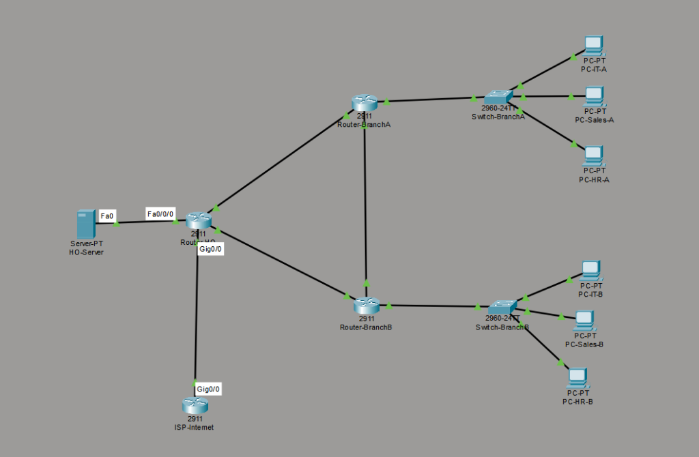
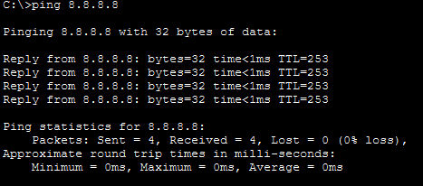
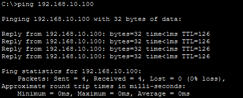
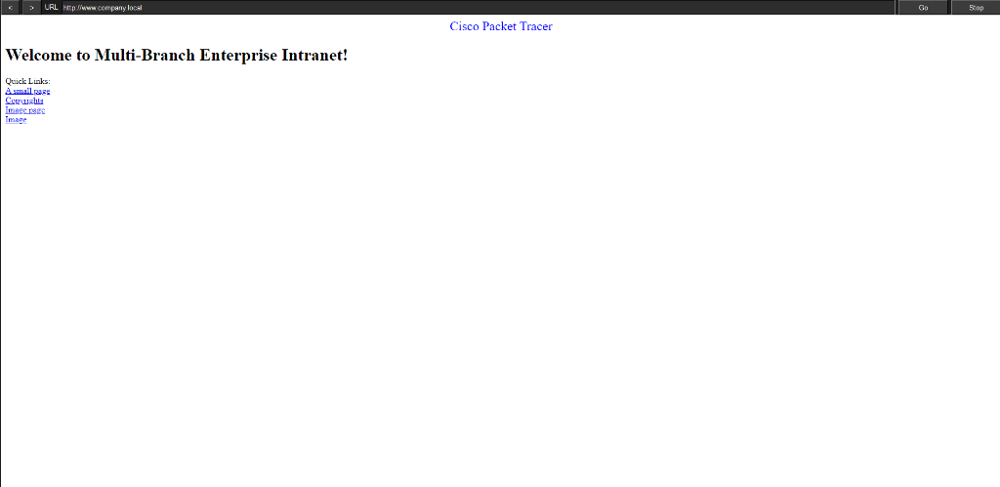
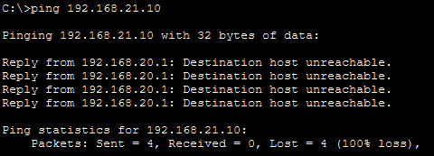

# โปรเจกต์จำลองระบบเครือข่ายองค์กรแบบหลายสาขาและการรักษาความปลอดภัย (Multi-Branch Enterprise Network & Security Lab)

🌐 **สลับภาษา / Language:** [ 🇹🇭 ภาษาไทย (Thai) ](README.th.md) | [ 🇬🇧 English ](README.md)

---



## 📌 ภาพรวมโปรเจกต์ (Project Overview)
คลังเก็บไฟล์นี้ (Repository) บรรจุโครงสร้างระบบ การตั้งค่าอุปกรณ์ (Configuration) และรูปภาพผลการทดสอบทั้งหมดของ **โปรเจกต์เครือข่ายองค์กร 3 สาขา (Multi-Branch Company Network Lab)** ที่ออกแบบและทดสอบจริงบนโปรแกรม Cisco Packet Tracer 

โปรเจกต์นี้สาธิตการออกแบบเครือข่ายระดับองค์กรตามมาตรฐาน CCNA ครอบคลุมการแบ่ง VLAN, การทำ Inter-VLAN Routing, การเชื่อมต่อ Dynamic Routing ด้วย OSPF, การแปลง IP ขอบเครือข่ายด้วย NAT/PAT, การทำระบบแจก IP อัตโนมัติข้ามสาขาด้วย Centralized DHCP Relay, การเปิดบริการ Intranet Web/DNS Server และการกำหนดนโยบายความปลอดภัยแบบ Zero-Trust ด้วย Extended ACL

---

## 🏗️ โครงสร้างเครือข่ายและตารางแจก IP (Network Architecture & IP Scheme)

### 1. แผนผังการแบ่ง Subnet องค์กร (`192.168.0.0/16` & `10.0.0.0/30`)
| สาขา / สายเชื่อมต่อ | แผนก / หน้าที่ (Department) | VLAN ID | IP Network / Prefix | IP Gateway | ช่วง IP ที่ใช้งานได้ (Usable Range) |
| :--- | :--- | :---: | :---: | :---: | :---: |
| **สำนักงานใหญ่ (HQ)** | Server Farm / Data Center | VLAN 1 (SVI) | `192.168.10.0/24` | `192.168.10.1` | `192.168.10.2` - `192.168.10.254` |
| **สาขา A (Branch 1)** | แผนก Sales | VLAN 10 | `192.168.20.0/24` | `192.168.20.1` | `192.168.20.2` - `192.168.20.254` |
| | แผนก HR | VLAN 20 | `192.168.21.0/24` | `192.168.21.1` | `192.168.21.2` - `192.168.21.254` |
| | แผนก IT | VLAN 30 | `192.168.22.0/24` | `192.168.22.1` | `192.168.22.2` - `192.168.22.254` |
| **สาขา B (Branch 2)** | แผนก Sales | VLAN 10 | `192.168.30.0/24` | `192.168.30.1` | `192.168.30.2` - `192.168.30.254` |
| | แผนก HR | VLAN 20 | `192.168.31.0/24` | `192.168.31.1` | `192.168.31.2` - `192.168.31.254` |
| | แผนก IT | VLAN 30 | `192.168.32.0/24` | `192.168.32.1` | `192.168.32.2` - `192.168.32.254` |
| **WAN Link 1** | HQ <----> Branch A | N/A | `10.0.0.0/30` | N/A | `10.0.0.1` (HQ) - `10.0.0.2` (Br A) |
| **WAN Link 2** | HQ <----> Branch B | N/A | `10.0.0.4/30` | N/A | `10.0.0.5` (HQ) - `10.0.0.6` (Br B) |
| **WAN Link 3** | Branch A <----> Branch B | N/A | `10.0.0.8/30` | N/A | `10.0.0.9` (Br A) - `10.0.0.10` (Br B)|
| **สายต่อ ISP** | HQ Edge <----> ISP | N/A | `200.1.1.0/30` | N/A | `200.1.1.2` (HQ) - `200.1.1.1` (ISP) |
| **ISP Internet** | Loopback จำลองเน็ต | N/A | `8.8.8.8/32` | N/A | `8.8.8.8` |

---

## ⚡ เทคโนโลยีสำคัญที่นำมาใช้งาน (Key Features & Implemented Technologies)

### 1. การแบ่ง VLAN และความปลอดภัยพอร์ตสวิตช์ (VLAN & Switch Port Security)
- **VLAN Segmentation**: แยกการจราจรข้อมูลตามแผนกเป็น VLAN 10 (Sales), VLAN 20 (HR) และ VLAN 30 (IT)
- **Access Ports**: พอร์ตสวิตช์ที่ต่อกับเครื่องคอมพิวเตอร์พนักงานถูกตั้งเป็น Access Port เพื่อป้องกันภัยคุกคามประเภท VLAN Hopping
- **Trunk Ports**: สายเชื่อมต่อระหว่าง Switch กับ Router ถูกตั้งเป็น 802.1Q Trunk (`switchport mode trunk`) เพื่อรับส่งข้อมูลหลาย VLAN ผ่านสายเส้นเดียว

### 2. การสื่อสารข้าม VLAN (Inter-VLAN Routing - Router-on-a-Stick)
- ตั้งค่า Subinterface บนเราเตอร์ `Branch1-R1` และ `Branch2-R1` (`Gi0/0.10`, `Gi0/0.20`, `Gi0/0.30`)
- ใช้การเข้ารหัส 802.1Q (`encapsulation dot1Q <vlan>`) ทำหน้าที่เป็น Default Gateway ประจำแต่ละ VLAN

### 3. ระบบนำทางอัตโนมัติ OSPF Dynamic Routing (Area 0)
- เชื่อมต่อ OSPF Area 0 แบบ Full-mesh ครอบคลุมเราเตอร์ 3 ตัว (`HQ-R1`, `Branch1-R1`, `Branch2-R1`)
- รองรับการกระจายภาระข้อมูลอัตโนมัติ **Equal-Cost Multi-Path (ECMP)** บนสาย WAN สำรอง
- กระจายเส้นทางออกอินเทอร์เน็ต `0.0.0.0/0` ไปยังทุกสาขาอัตโนมัติด้วยคำสั่ง `default-information originate`

### 4. ระบบแปลง IP ขอบเครือข่าย (Edge NAT/PAT & Internet Gateway)
- คอนฟิก **NAT Overload (PAT)** บน `HQ-R1` (`ip nat inside source list 1 interface Gi0/0 overload`)
- ช่วยให้อุปกรณ์ Private IP (`192.168.0.0/16`) ทุกสาขา สามารถแชร์ Public IP ออกเล่นอินเทอร์เน็ตภายนอก (`8.8.8.8`) ได้พร้อมกัน

### 5. บริการศูนย์ Data Center และเซิร์ฟเวอร์กลาง (Enterprise Data Center Services)
- **Data Center Gateway**: คอนฟิก SVI `interface Vlan1` (`192.168.10.1`) ผ่านการ์ดขยาย HWIC บน `HQ-R1`
- **Intranet Web Portal**: เปิดบริการ HTTP/HTTPS Web Server บน `HQ-Server` (`192.168.10.100`)
- **Internal DNS Server**: ตั้งค่าแปลชื่อโดเมนองค์กร `www.company.local` -> `192.168.10.100`
- **Centralized DHCP Server & Relay Agent**: ตั้งค่าแจก IP อัตโนมัติจากศูนย์กลางร่วมกับคำสั่ง `ip helper-address 192.168.10.100` บนเราเตอร์สาขา

### 6. นโยบายความปลอดภัยระดับองค์กร (Zero-Trust Security via Extended ACL)
- คอนฟิก Extended Access List (`access-list 100`) บน `Branch1-R1` (พอร์ต `Gi0/0.10` ขาเข้า)
- **Security Policy**: บล็อกวง Sales (`192.168.20.0/24`) ห้ามเข้าถึงวง HR (`192.168.21.0/24`) แต่ยังคงอนุญาตให้เข้าถึงเว็บพอร์ทัล `www.company.local`, DNS และอินเทอร์เน็ตได้ตามปกติ

---

## 💡 อุปสรรคและการเรียนรู้ (Challenges & What I Learned)
1. **การกระจายเส้นทาง OSPF Outbound**: ได้เรียนรู้ว่า Edge Router (`HQ-R1`) ต้องใช้คำสั่ง `default-information originate` เพื่อกระจายเส้นทางออกเน็ตไปยังเราเตอร์สาขา
2. **ขอบเขตพอร์ต NAT Overload**: พบว่าพอร์ต WAN ขาเข้าที่รับข้อมูลจากสาขา (`Gi0/1`, `Gi0/2`) ต้องระบุเป็น `ip nat inside` เพื่อให้ NAT ทำงานสมบูรณ์
3. **ความแม่นยำของ Wildcard Mask ใน ACL**: ได้เรียนรู้จากข้อผิดพลาดของการใช้ Wildcard Mask `/16` (`0.0.255.255`) ที่ไปบล็อกเครื่อง Server โดยไม่ตั้งใจ การปรับเป็น `/24` (`0.0.0.255`) ช่วยจำกัดวงการบล็อกได้ถูกต้อง
4. **การบันทึก Config กันหาย**: ตระหนักถึงความสำคัญของการเซฟ Config ลง NVRAM ด้วยคำสั่ง `write memory` ก่อนการดับไฟเราเตอร์เพื่อเสียบการ์ด HWIC

---

## 🧪 สรุปผลการทดสอบระบบ (Verification & Test Results)

| รายการทดสอบ (Test Case) | รายละเอียด | ต้นทาง (Source) | ปลายทาง (Destination) | ผลลัพธ์ที่คาดหวัง | สถานะ | รูปภาพหลักฐาน |
| :--- | :--- | :--- | :--- | :--- | :---: | :--- |
| **1. ทดสอบออกอินเทอร์เน็ต** | NAT/PAT & Default Route Ping | `PC-Sales-A` | `8.8.8.8` (ISP) | `Reply from 8.8.8.8` (Loss 0%) | ✅ ผ่าน | `test-results/ping-internet-test.png` |
| **2. ทดสอบปิงหา Server** | OSPF Inter-Branch Server Access | `PC-Sales-A` | `192.168.10.100` | `Reply from 192.168.10.100` | ✅ ผ่าน | `test-results/ping-server-test.png` |
| **3. ทดสอบเปิดเว็บองค์กร** | DNS A-Record & Web Portal Access | `PC-Sales-A` | `www.company.local` | เปิดหน้าเว็บพอร์ทัลสำเร็จ | ✅ ผ่าน | `test-results/web-portal-test.png` |
| **4. ทดสอบความปลอดภัย ACL** | Zero-Trust Inter-VLAN Block Policy | `PC-Sales-A` | `192.168.21.10` (HR) | `Destination host unreachable` | ✅ ผ่าน | `test-results/acl-block-test.png` |

### รูปภาพหลักฐานการทดสอบจริง (Test Result Artifacts)

#### การทดสอบที่ 1: ทดสอบออกอินเทอร์เน็ตผ่าน NAT/PAT (`ping 8.8.8.8`)


#### การทดสอบที่ 2: ทดสอบปิงหา Server ข้ามสาขา (`ping 192.168.10.100`)


#### การทดสอบที่ 3: ทดสอบเปิดเว็บพอร์ทัลองค์กร (`www.company.local`)


#### การทดสอบที่ 4: ทดสอบระบบความปลอดภัย บล็อก Sales ไป HR (`ping 192.168.21.10`)


---

## 📂 โครงสร้างคลังจัดเก็บไฟล์ (Repository Structure)

```text
multi-branch-network-lab/
├── README.md                                  # เอกสารอธิบายโปรเจกต์ภาษาอังกฤษ (Primary)
├── README.th.md                               # เอกสารอธิบายโปรเจกต์ภาษาไทย (Thai Version)
├── .gitignore                                 # ไฟล์กำหนดการละเว้น (.DS_Store, Thumbs.db, *.tmp, *.log)
├── topology/
│   └── topology-diagram.png                   # รูปผังเครือข่าย 3 สาขา + Data Center + ISP
├── packet-tracer/
│   └── multi-branch-network-lab.pkt           # ไฟล์โปรเจกต์ Cisco Packet Tracer สมบูรณ์
├── test-results/
│   ├── ping-internet-test.png                 # รูปผลการทดสอบปิงออกเน็ต (8.8.8.8)
│   ├── ping-server-test.png                   # รูปผลการทดสอบปิงหา Server (192.168.10.100)
│   ├── web-portal-test.png                    # รูปผลการทดสอบเปิดเว็บเบราว์เซอร์ www.company.local
│   └── acl-block-test.png                     # รูปผลการทดสอบระบบความปลอดภัย Extended ACL
├── configs/
│   ├── HQ-R1.txt                              # Config เราเตอร์ Head Office (OSPF/NAT/SVI Server)
│   ├── Branch1-R1.txt                         # Config เราเตอร์ Branch A (RoAS/OSPF/DHCP Relay/ACL 100)
│   ├── Branch1-SW1.txt                        # Config สวิตช์ Branch A (VLANs/Trunk)
│   ├── Branch2-R1.txt                         # Config เราเตอร์ Branch B (RoAS/OSPF/DHCP Relay)
│   ├── Branch2-SW1.txt                        # Config สวิตช์ Branch B (VLANs/Trunk)
│   └── ISP-R1.txt                             # Config เราเตอร์ ISP (Loopback 8.8.8.8)
└── docs/                                      # โฟลเดอร์สำหรับเอกสารเพิ่มเติม
```

---

## 🚀 วิธีการเปิดใช้งานแล็บใน Cisco Packet Tracer

1. คัดลอก (Clone) คลังจัดเก็บนี้ลงเครื่องของคุณ:
   ```bash
   git clone https://github.com/GGun32993/multi-branch-network-lab.git
   ```
2. เปิดโปรแกรม **Cisco Packet Tracer** (แนะนำเวอร์ชัน 8.0 ขึ้นไป)
3. เปิดไฟล์โปรเจกต์: `packet-tracer/multi-branch-network-lab.pkt`
4. รอประมาณ 30-40 วินาที เพื่อให้ OSPF และ Spanning Tree Converge สายสัญญาณเป็นสีเขียวทั้งหมด
5. ทดลองใช้งานจากเครื่อง PC ฝั่งสาขา (เช่น `PC-Sales-A`):
   - สลับโหมด IP เป็น **DHCP** เพื่อรับ IP อัตโนมัติจากศูนย์กลาง
   - เปิด **Command Prompt** แล้วสั่ง: `ping 8.8.8.8` หรือ `ping 192.168.10.100`
   - เปิด **Web Browser** แล้วพิมพ์: `www.company.local`
